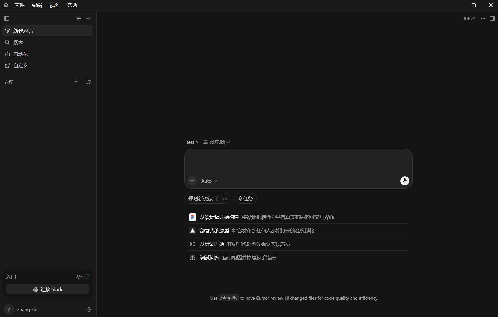
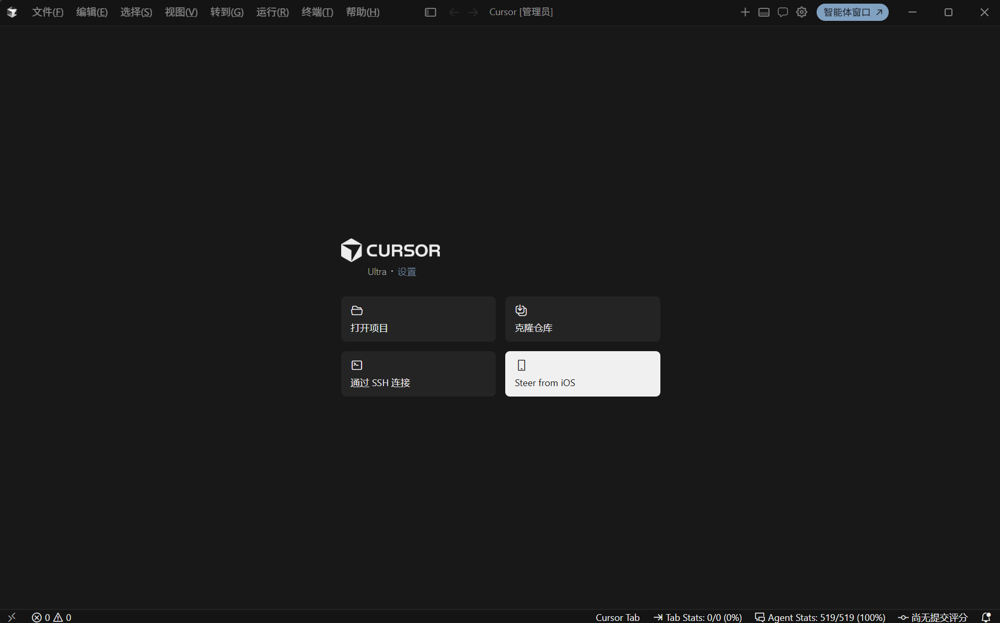
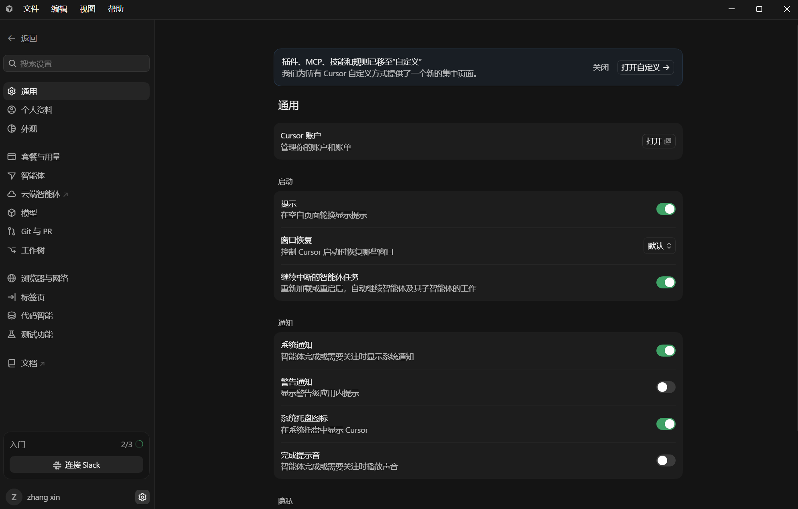

<h1 align="center">Cursor 中文启动器</h1>

  让 Windows 版 Cursor 更完整地显示简体中文，同时保留官方程序、更新器和使用习惯。

  <strong>简体中文</strong> · <a href="README.en.md">English</a>

  
  
  
  
  

> [!IMPORTANT]
> 这是非官方社区项目，与 Anysphere、Cursor、微软或 OpenAI 没有隶属或认可关系。当前版本尚未进行代码签名，Windows SmartScreen 可能显示警告。

  

## 下载与安装

1. 前往 [Releases](https://github.com/Hakunm/cursor-zh-launcher/releases/latest) 下载 `CursorZhLauncher-1.0.1-Setup.exe`。
2. 完全退出所有正在运行的 Cursor 窗口。
3. 运行安装程序，然后从桌面打开“Cursor 中文启动器”。

安装器会保留官方 Cursor 的快捷方式、更新器、URL 协议和文件关联，并额外创建一个使用 Cursor 图标的中文启动入口。以后从这个入口启动 Cursor 即可。

> [!TIP]
> SmartScreen 出现时，可以先核对 Release 页面公布的 SHA-256。确认文件来自本仓库后，选择“更多信息”继续运行。

## 主要功能

- 标准编辑器界面使用与 Cursor 内置 VS Code 版本匹配的官方简体中文语言包。
- 补齐 Cursor Agents、IDE、设置、自动化、自定义页面和常用菜单中的专有文案。
- 每次启动都会检查语言状态，Cursor 更新后会自动重新准备被重置的用户配置。
- 不修改 `Cursor.exe` 或 Cursor 安装目录中的任何官方文件。
- 不收集遥测，不记录账户、聊天内容、代码或本地文件内容。

## 界面展示

  
   
  IDE 窗口的顶部菜单、标题栏和欢迎操作获得中文覆盖。

  
   
  Cursor 设置页中的导航、说明、选项和操作均获得中文覆盖。

## 版本兼容性

启动器会识别当前安装的 Cursor，并尽可能兼容大部分 Windows x64 版本。当前已认证 Windows x64 的 Cursor 3.16.17、3.17.8 和 3.18.25。版本不同不会直接停用汉化；安全且作用范围明确的翻译会继续应用。Cursor 若大幅调整界面，个别新页面可能暂时残留英文，后续版本会继续补充适配。

## 安全与隐私

- 官方 Cursor 安装目录保持只读，使用前后核心文件校验值不变。
- 只写入启动器自己的安装目录和可恢复的用户语言配置。
- 修改语言配置前会创建备份；卸载时只恢复仍由本工具管理的内容。
- 本地通信仅使用随机的回环地址端口，不向局域网或公网开放服务。
- 更新检查只访问本仓库的 GitHub Releases，不会静默下载或执行程序。

## 常见问题

**Cursor 更新后会完全失效吗？**

通常不会。启动器会在下次启动时重新准备语言环境，安全的精确翻译也会继续工作。重大界面改版可能暂时出现少量英文，但不会修改或阻止 Cursor 更新。

**为什么要求先退出 Cursor？**

已运行的 Cursor 不会重新读取启动语言状态。启动器也不会强制关闭可能含有未保存内容的窗口，因此需要你手动完全退出后再启动。

**可以恢复原版界面吗？**

可以。卸载“Cursor 中文启动器”会尝试恢复其管理的语言配置，官方 Cursor 程序和原有快捷方式始终保留。

**为什么 Windows 会显示 SmartScreen？**

当前版本没有商业代码签名证书。请只从本仓库 Releases 下载，并核对随发布提供的 SHA-256。

## 许可证

项目以 [GNU GPL v3.0 only](LICENSE) 发布。第三方依赖声明见 [THIRD_PARTY_NOTICES.md](THIRD_PARTY_NOTICES.md)。本项目不会打包或重新分发 Cursor、微软语言包 VSIX 或其他第三方汉化资源。
